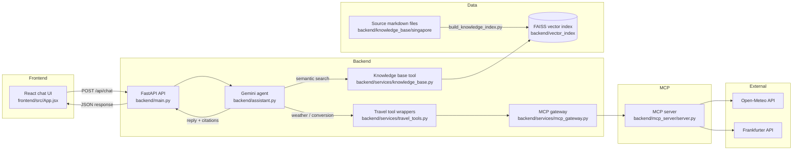

# Singapore Travel Agent

[GitHub repository](https://github.com/AbhishekJoshi03/AbhishekJoshi_3153542_AI-and-ML)

A Singapore travel planning assistant that combines a local knowledge base with live external tools via an MCP layer. The app uses a FastAPI backend, a tool-calling Gemini model, and a Vite + React frontend to answer questions about attractions, food, neighbourhoods, itineraries, weather, and INR-to-SGD conversions.

## Overview

This project is designed as a practical RAG-based travel assistant for Singapore. It answers questions using:

- a static local knowledge base built from curated Singapore travel sources
- a FAISS vector index for semantic retrieval
- a Gemini model with tool calling for planning and reasoning
- live data tools exposed through an MCP server for weather and currency conversion

The app is intentionally simple and transparent: every response can show which knowledge sources were used and whether live data was fetched.

---

## Architecture



### Runtime flow

1. The frontend sends a user message plus a session ID to the FastAPI backend.
2. The backend keeps a per-session conversation history in memory.
3. The Gemini model is invoked with the system prompt and a set of tools.
4. If the model decides it needs factual travel info, it calls the retrieval tool.
5. If the model needs current weather or currency, it calls the MCP-backed travel tools.
6. Tool results are fed back into the same conversation loop until the model returns a final answer.
7. The backend returns the final text, tool names invoked, citations, and whether live data was used.

---

## Repository structure

```text
singapore-travel-agent/
├── backend/
│   ├── __init__.py
│   ├── assistant.py
│   ├── main.py
│   ├── ingestion/
│   │   ├── __init__.py
│   │   └── build_knowledge_index.py
│   ├── knowledge_base/
│   │   └── singapore/
│   │       ├── essential_travel_information.md
│   │       ├── things_to_do.md
│   │       └── wikivoyage.md
│   ├── mcp_server/
│   │   ├── __init__.py
│   │   └── server.py
│   ├── scripts/
│   │   ├── __init__.py
│   │   └── preview_knowledge_answer.py
│   ├── services/
- Node.js 20.19+ (or Node.js 22.12+ for the current Vite toolchain)
│   │   ├── __init__.py
│   │   ├── knowledge_base.py
│   │   ├── mcp_gateway.py
│   │   └── travel_tools.py
│   └── vector_index/
- Relative dates such as “tomorrow” and “next week” are interpreted by the language model before it calls the weather tool; the tool itself expects explicit `YYYY-MM-DD` dates.
- The knowledge search filters low-relevance matches and reports when the indexed content is insufficient.
│       ├── index.faiss
│       └── index.pkl
├── frontend/

│   ├── index.html
│   ├── package.json
│   ├── vite.config.js
│   ├── public/
│   └── src/
│       ├── App.css
│       ├── App.jsx
│       ├── components/
│       │   └── ChatBubble.jsx
│       ├── index.css
│       └── main.jsx
├── README.md
├── requirements.txt
└── .env (local, not tracked)
```

---

## Knowledge base sources

The static knowledge base is built from three markdown files under `backend/knowledge_base/singapore/`:

- `essential_travel_information.md`
  - practical tips, transport, entry requirements, safe travel guidance, and Singapore basics
- `things_to_do.md`
  - attractions, experiences, neighbourhoods, and activity ideas
- `wikivoyage.md`
  - travel guide content for neighborhoods, culture, heritage, food, and planning notes

These are ingested and tagged with source metadata during index creation in `backend/ingestion/build_knowledge_index.py`.

### Source metadata mapping

The ingestion script attaches the following source titles and URLs to each chunk:

- Wikivoyage — Singapore Travel Guide
  - https://en.wikivoyage.org/wiki/Singapore
- Visit Singapore — Essential Travel Information
  - https://www.visitsingapore.com/travel-tips/essential-travel-information/
- Visit Singapore — Things To Do
  - https://www.visitsingapore.com/things-to-do/top-things-to-do/

This metadata is retained in the FAISS index and later surfaced as citations in assistant responses.

---

## RAG workflow

The retrieval layer is implemented in `backend/services/knowledge_base.py`.

### Build phase

`backend/ingestion/build_knowledge_index.py` does the following:

1. loads all `.md` files from `backend/knowledge_base/singapore/`
2. uses `DirectoryLoader` + `TextLoader` to read them as documents
3. splits them with `RecursiveCharacterTextSplitter`
4. tags each chunk with a human-readable source title and URL
5. embeds the chunks with `GoogleGenerativeAIEmbeddings`
6. stores them in a FAISS vector index at `backend/vector_index/`

### Query phase

When the agent calls `search_travel_knowledge_base`, it:

1. receives a user query
2. uses the same embedding model to embed the query
3. retrieves the top 4 matching chunks from the FAISS store
4. formats them with source metadata and content
5. returns the content to the LLM as grounded travel context

This keeps the assistant anchored to curated, destination-specific information while still allowing flexible natural-language retrieval.

---

## MCP tools and live data integration

The live data layer is separate from the static RAG knowledge base and is designed for time-sensitive information.

### MCP server

The local MCP server lives in `backend/mcp_server/server.py` and exposes two tools:

- `fetch_singapore_weather(city, start_date, end_date)`
  - calls Open-Meteo for current and forecast weather in Singapore
  - returns current readings and daily forecast data
- `fetch_currency_conversion(amount, from_currency, to_currency)`
  - calls Frankfurter for live exchange rates
  - returns the exchange rate and converted amount

### MCP gateway

`backend/services/mcp_gateway.py` creates a client session to the stdio-based MCP server and invokes named tools using the `mcp` package.

### Agent-facing wrappers

`backend/services/travel_tools.py` exposes the following tool definitions to the LLM:

- `get_current_weather(start_date="", end_date="")`
- `convert_indian_rupees_to_sgd(amount)`

These wrappers intentionally map user intent to the live MCP tools and keep the final assistant logic clean.

---

## Prompt and context strategy

The model behavior is defined in `backend/assistant.py` via `ASSISTANT_SYSTEM_PROMPT`.

### System prompt goals

The prompt tells the assistant to:

- treat itself as a Singapore travel planning assistant
- use the knowledge base for stable travel information
- use MCP tools for current weather and currency conversion
- never invent facts
- preserve conversational context from earlier turns
- clearly separate recommendations from factual information
- cite relevant sources when returning knowledge-base facts
- label live-data outputs as MCP-provided information

### Conversation behavior

The assistant uses a tool-calling loop:

1. append the latest user message to the session history
2. invoke Gemini with the full message history and the available tools
3. if Gemini emits a tool call, execute it and append the tool result as a `ToolMessage`
4. repeat until the model returns a final textual answer

### Context and memory

Each browser session gets a unique `session_id` and a conversation list stored in memory by FastAPI. This means:

- different browser tabs keep separate chat histories
- follow-up questions like “this trip,” “day 2,” or “that itinerary” can be resolved against prior turns in the same session
- session state resets when the backend process restarts

### Citation tracking

The assistant extracts source metadata from search results and stores it in the response payload under `citations`. The frontend renders those citations along with the message bubble, helping the user understand where the answer came from.

---

## Setup instructions

### Prerequisites

- Python 3.10+
- Node.js 20.19+ (or Node.js 22.12+ for the current Vite toolchain)
- npm
- A Google API key for Gemini embeddings and chat generation

### 1) Create and activate a Python environment

```bash
python -m venv .venv
```

On macOS/Linux:

```bash
source .venv/bin/activate
```

On Windows PowerShell:

```powershell
.venv\Scripts\Activate.ps1
```

### 2) Install Python dependencies

```bash
pip install -r requirements.txt
```

### 3) Add your API key

Create a local `.env` file in the project root and add:

```env
GOOGLE_API_KEY=your_google_api_key_here
```

The project uses `python-dotenv` and the LangChain Google Generative AI integration, so this environment variable is used at runtime.

### 4) Build the FAISS knowledge index

This step loads the markdown sources and generates the vector index used by the RAG tool.

```bash
python -m backend.ingestion.build_knowledge_index
```

A pre-generated index is already checked into the repo, but rebuilding it is the correct step after editing any of the source markdown files.

### 5) Start the backend

```bash
uvicorn backend.main:api --reload --host 0.0.0.0 --port 8000
OR
python -m uvicorn backend.main:api --reload
```

The API exposes:

- GET `/` — service status
- POST `/api/chat` — chat endpoint

Example request:

```json
{
  "session_id": "demo-session",
  "message": "What are the best food neighborhoods in Singapore?"
}
```

### 6) Start the frontend

```bash
cd frontend
npm install
npm run dev
```

The frontend typically runs on:

- http://localhost:5173

It sends requests to the backend at:

- http://localhost:8000

---

## Sample questions and application responses

Below are example user requests and the kinds of answers the application is designed to provide.

| User question | What the app does | Example response pattern |
| --- | --- | --- |
| “What are the best neighborhoods for first-time visitors?” | Uses the local knowledge base | Recommends areas such as Marina Bay, Kampong Glam, Chinatown, and explains why they fit different travel styles |
| “Can you plan a 3-day itinerary for Singapore?” | Uses knowledge-base travel planning guidance | Produces a day-by-day plan with landmarks, food stops, and neighborhood flow |
| “What is the weather like in Singapore this week?” | Calls the MCP weather tool | Reports current or forecast weather using live Open-Meteo data and labels it as live MCP data |
| “Convert ₹50,000 to SGD” | Calls the MCP currency tool | Returns the latest INR-to-SGD exchange rate and the converted amount |
| “What are some indoor activities in Singapore when it rains?” | Uses the knowledge base and reasoning | Suggests museums, indoor attractions, and covered experiences grounded in Singapore travel content |

### Example illustrative responses

#### Example 1 — itinerary request

User:

> Suggest a 3-day itinerary for a first-time visitor.

Assistant:

> Here is a practical 3-day Singapore itinerary: Day 1 around Marina Bay and the Civic District, Day 2 explore Chinatown and Kampong Glam, and Day 3 visit Gardens by the Bay, Sentosa, or a food trail in Little India. These recommendations are based on the Singapore travel knowledge base and local source material.

#### Example 2 — weather lookup

User:

> What is the weather in Singapore this week?

Assistant:

> Based on live MCP weather data from Open-Meteo, Singapore is expected to have [temperature and rain conditions]. I recommend carrying an umbrella on [specific day] if precipitation is forecast.

#### Example 3 — INR conversion

User:

> Convert ₹50,000 to SGD.

Assistant:

> Using live MCP exchange-rate data, ₹50,000 converts to approximately SGD X.XX at the current rate. This is a live currency conversion result from the MCP service.

---

## Notes and constraints

- The knowledge base is curated and static; it is not meant to replace real-time information.
- Live weather and live currency are intentionally separated from the document search layer.
- The app keeps per-session chat memory in-process, so restarting the backend clears conversation state.
- The project is a lightweight demonstration of a tool-using travel assistant rather than a production-grade multi-user travel platform.

---

## Summary

This project demonstrates a compact but realistic AI travel assistant architecture:

- local RAG for travel knowledge
- live MCP tools for weather and exchange rates
- structured prompt instructions to keep the assistant grounded and honest
- a simple frontend to interact with the assistant in real time

It is a good template for building domain-specific assistants that need both stable structured knowledge and up-to-date external information.
